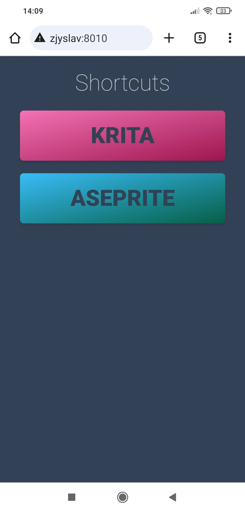
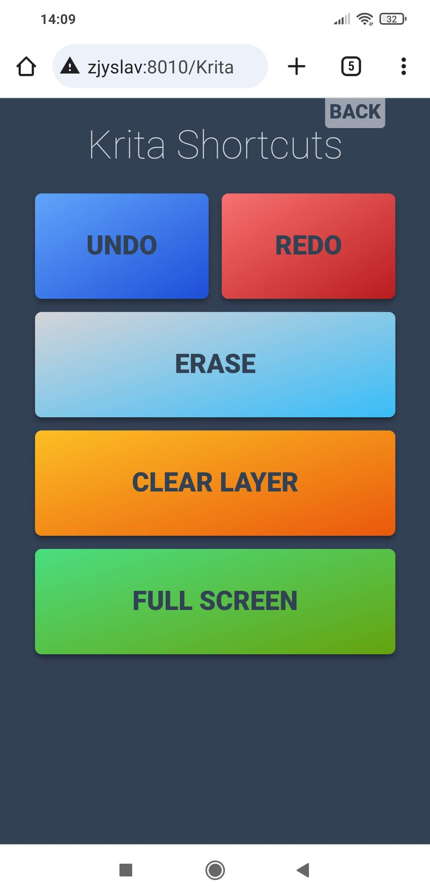
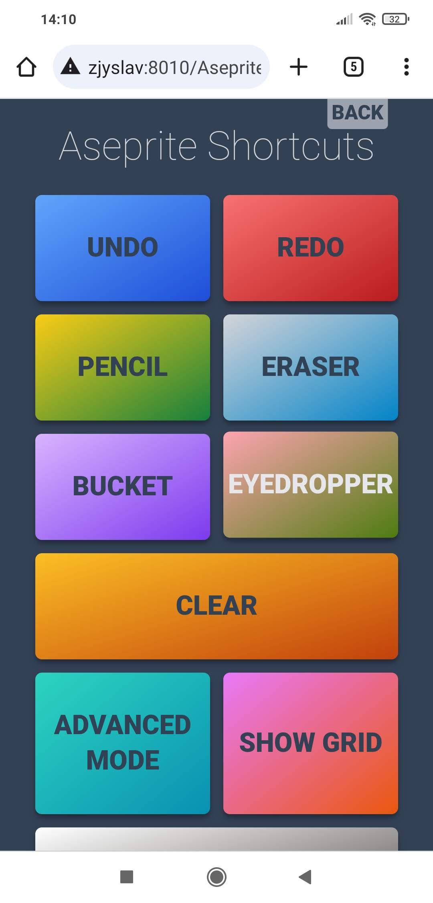
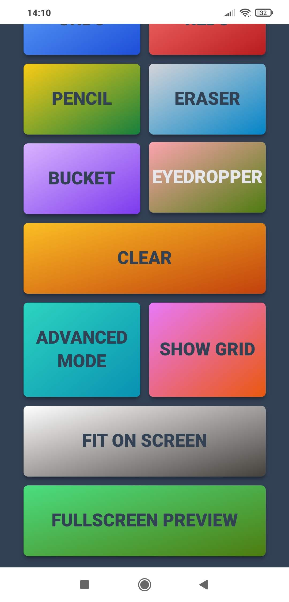

# Shortcuts
A simple application that allows user to fire shortcuts in a specified program on Windows machine via Blazor web app.

## Purpose
The general purpose of this app was initially to help access shortcuts in [Krita](https://krita.org/) graphics program when using pen tablet without sufficient amount of buttons. Reaching keyboard and pushing up to 3 keys can be awkward while drawing and having to find a button in Krita to press can break a flow of your work, so I created a solution in form of a web app that you can open on your phone and have a few easy to press buttons ready.
I decided to expand the project to handle also other software, such as [Aseprite](https://www.aseprite.org/).

## Technologies used

* C#/.NET
* Blazor Server
* gRPC
* Windows Forms
* user32.dll via DllImport
* Tailwind CSS

## Screenshots

| Home  | Krita | Aseprite | Aseprite |
:---:|:---:|:---:|:---:
|  |  |  |  |

## How it works
The solution consists of 2 projects.
- Blazor Web app
- Shortcuts Service app
### Blazor Web app
This it the user interface. It has a few sample buttons, but any number you need can be added with ease. It uses gRPC to send request to Shortcuts Service.
To use it in home scenario, you could e.g. publish this project to a folder, then host it on local network using IIS and then access it with your phone connected to your network.

The list of shortcuts is defined in `appsettings.json`, so you can add new ones, and even change keystrokes associated with them in runtime. See [SendKeys Class Documentation](https://learn.microsoft.com/en-us/dotnet/api/system.windows.forms.sendkeys?view=windowsdesktop-8.0) to see how the keystrokes should be formatted.

Once a new shortcut is defined, you just need to add a public method to `ShortcutsClient` class that calls `ExecuteShortcut()` private method passing in the shortcut signature matching the definition in `appsettings.json` and then call this method from `Home.razor` page using a button.

You could take the `ShortcutsClient.cs` and `Protos/shortcut.proto` files and build your own UI if Blazor Web app is not what you want to use.

### Shortcuts Service app
This is a gRPC server app that runs in the background on your Windows machine where you want the shortcuts to be fired.

When it receives a `ShortcutsRequest` message it looks for all processes with a given name, brings their main window to the foreground and imitates the specified keyboard input for each. In case of Krita, it uses just one process and one window (it automatically closes any new process I try to open after the first one), so looping through all processes it finds shouldn't cause any problems, but note that if you want to use this app with other programs, this behavior might not be what you want. In that case consider changing the logic of `ExecuteShortcut()` method in `ShortcutService` class.

This app can run only on Windows, because it uses `System.Windows.Forms.dll` and `user32.dll` libraries.

I set the project's Output type to Windows Executable, so that it works in the background without a console window. In order to kill the process you need to use Task Manager.

You can add it to your startup applications if you want it to be always available. If you run it on a different machine than the one hosting the web app, you need to open the ports it's listening on in your firewall and provide the right address in Blazor Web app's `appsettings.json`. 

## My process
My initial idea was to use `user32.dll` API's `PostMessage` function to send `WM_KEYDOWN` messages to the window, but it seemed to work only with single key shortcuts, but failed when I tried to send `CTRL+Z`. I inspected the messages received by the proces using [Spy++](https://learn.microsoft.com/pl-pl/visualstudio/debugger/how-to-start-spy-increment?view=vs-2022) and experimented with sending `WM_SYSKEYDOWN` and `WM_SYSKEYUP` messages. I even tried sending `WM_CHAR` message with value of 26, which corresponds to `CTRL+Z` input, but nothing seemed to work. I also didn't see any `WM_COMMAND` messages that I could use to my advantage.

While researching the solution, I came across many people saying that `PostMessage` is not reliable and the better way of approaching this is to use `SendKeys` class found in `System.Windows.Forms.dll` library. In order to access it, I needed to make my project use WinForms, which works, but apparently the target framework needs to be changed to .NET 5.0 for a moment before changing it back to .NET 8.0 in order for me to be able to access the class I need.

At this point it was still a single project solution with onlu blazor. While it seemed to be working as intended during debugging, it had problems using WinForms, so instead of trying to force it to work, I decided to decouple the execution of shortcuts from the UI. I started with an API, but ran into the same problems as with Blazor, as they are both **ASP.NET** projects and act similarly.

I started researching other ways of apps communicating. I came across **.NET Remoting**, but Wikipedia told me it was replaced by **Windows Communication Foundation**, so I looked into it and on the very first page I opened in the [WCF documentation](https://learn.microsoft.com/en-us/dotnet/framework/wcf/whats-wcf) I read that there's an alternative to it called **gRPC**, so I decided to try this instead.

I started with Tim Corey's [Intro to gRPC in C# - How To Get Started](https://youtu.be/QyxCX2GYHxk?si=rlNoYoCu-e8a0Eex) YouTube video, which gave me enough basics and confidence to build my own gRPC server and add gRPC client capabilities to the app I already had.

The plan I had at this point was to have a Blazor client app hosted on IIS and the server app running as a Windows service in the background on the same PC. For that I had to tweak `program.cs` a bit for it to be a viable Windows service, but it worked. However, it turned out that even though it's running, it doesn't do its intended task. I diagnosed the problem to be that even though the app finds the krita.exe process, it sees its `MainWindowHandle` property as 0. After some digging in the internet and trying some recommended solutions of refreshing the process, I [learned](https://stackoverflow.com/a/24294244/21318735, "Stack Overflow explanation") that Windows services are being run in a separate session than the regular desktop apps, so they don't have access to their window's handle.

That's when I decided that I don't need it to be a service, so I undid the tweaks to the app, found [a way for it to run without a console window visible](https://stackoverflow.com/a/2686476/21318735) and called it a day.

The purpose I made this is to work with Krita, but the way it's built makes it possible to work with any process that has a visible window and all there needs to be changed is in the UI project.
